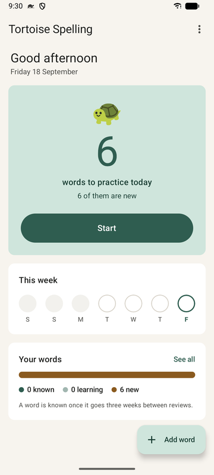
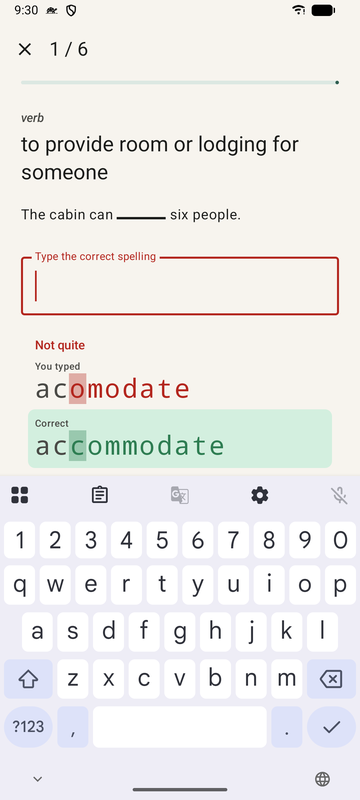
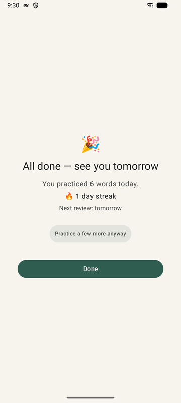
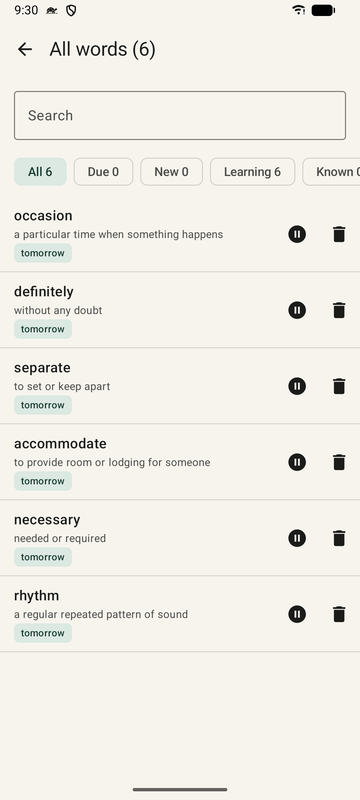

# 🐢 Tortoise Spelling

A native Android app for learning to spell words you don't already know. You build
your own word list, and the app drills you with spaced repetition and a once-a-day
reminder so the habit sticks. Slow and steady wins the race 🐢.

## 🐇 How it works

- 📝 **Your words, not a canned list.** Add the words you want to learn; Claude can
  fill in the definition and example, or you type them yourself.
- ✍️ **You spell it from memory.** Each review shows the definition and an example
  sentence with the word blanked out — no multiple choice.
- ✅ **Immediate correction.** A miss shows a character-level diff, then makes you
  retype the word correctly before moving on.
- 🐢 **Spaced repetition (SM-2).** Correct spellings push the word further out
  (1 day → 6 days → longer); a miss brings it back tomorrow. See
  [Spaced repetition](#-spaced-repetition) below.
- 🏁 **A real finish line.** Sessions end with an explicit "all done" screen;
  an optional "practice more" mode doesn't touch your schedule.
- 🔔 **Daily reminder.** One local notification, only when words are due. On Android
  13+ the app asks for notification permission once you've added your first word.

Everything except word lookup works fully offline with no account and no API key.
There are no ads, no analytics and no tracking: see the [privacy policy](PRIVACY.md).

## 🐰 Spaced repetition

Tortoise Spelling schedules reviews with **SM-2**, the algorithm behind apps like
Anki 🃏 — reviewing a word right as you're about to forget it.

- 🎯 **Per-word schedule.** Each word tracks its own repetition count, ease factor,
  and due date.
- ✅ **Right → interval grows.** 1 day, then 6, then multiplied by the ease factor
  each time, capped at a year.
- ❌ **Wrong → resets to tomorrow**, and the ease factor drops a little.
- 🎲 **Fuzzed intervals** so words added together don't all come due the same day.
- 🐰🐇 **Two rabbits, one tortoise.** The hares sprint ahead early, but SM-2 makes
  sure the tortoise 🐢 wins: small, correctly-spaced daily reviews beat cramming.
- 🌱 **New words trickle in.** Adding a whole bunch at once? Limit how many new words
  you get each day in ⚙️ Settings so you don't get overwhelmed.

## 📱 Screens

| Today | Review | Finished | Word list |
|---|---|---|---|
|  |  |  |  |

## 🤖 Word lookup with Claude

Adding a word can call the Anthropic Messages API to generate a definition, example
sentence, and part of speech, and to correct the spelling of what you typed.

- Lookups always run on the cheapest model, chosen automatically.
- The API key is stored on-device, encrypted with an Android keystore key.

To enable it: open ⚙️ **Settings**, paste an Anthropic API key, and press **Test key**.

### 🔒 Data safety

- Backup export carries a version; importing a newer-format backup is refused
  rather than half-read. Import merges, so restoring a backup never undoes progress.

## ▶️ Running it

Requirements: Android Studio (or the Android SDK + JDK 17), an emulator or device on
Android 8.0 (API 26) or newer.

Open the project in Android Studio and press Run, or from a terminal:

```bash
./gradlew assembleDebug
```

```bash
./gradlew testDebugUnitTest
```

The debug APK lands in `app/build/outputs/apk/debug/`. To install it:

```bash
adb install -r app/build/outputs/apk/debug/app-debug.apk
```

## 🧪 Testing

| Layer | Where | Runs on |
|---|---|---|
| Unit tests | `app/src/test/` | JVM, no device |
| Live-API integration test | `ClaudeIntegrationTest` | JVM, real Anthropic API |
| End-to-end BDD tests | [`e2e/`](e2e/README.md) | The real APK on an emulator |
| Release script tests | `scripts/*.test.mjs` | Node, no device |

[CI](.github/workflows/ci.yml) runs the unit tests, lint, the release script tests and
the e2e suite's device-free checks on every push to main and every pull request. The e2e
scenarios themselves need an emulator, so they run locally.

```bash
node --test 'scripts/*.test.mjs'
```

### Live-API integration test

`ClaudeIntegrationTest` exercises the real lookup flow and is skipped unless an API
key is present in the environment. `--rerun` makes Gradle run it even when nothing but
the environment has changed:

```bash
TORTOISESPELLING_ANTHROPIC_KEY=sk-ant-... ./gradlew testDebugUnitTest --tests '*ClaudeIntegrationTest' --rerun
```

### End-to-end BDD tests

Gherkin scenarios ("When I add the word … Then Home shows 1 word to practice today") run
against the installed app with Appium, WebdriverIO and Cucumber. See
[`e2e/README.md`](e2e/README.md) for setup, commands and conventions.

```bash
cd e2e && npm install && npm run e2e
```

## 📦 Releases

There's no Play Store listing: releases are signed APKs on the GitHub Releases page,
installed by sideloading. What changed in each version is in [CHANGELOG.md](CHANGELOG.md).

To cut one:

1. Check that [CHANGELOG.md](CHANGELOG.md) lists the changes under **[Unreleased]**.
2. Bump the version. This raises `versionName` (major, minor or patch) and `versionCode`
   in `app/build.gradle.kts`, and moves the notes under a heading dated today:

   ```bash
   node scripts/bump-version.mjs minor
   ```

3. Commit, and merge to main.
4. Tag main with the new version and push the tag:

   ```bash
   git tag v0.1.0 && git push origin v0.1.0
   ```

The [release workflow](.github/workflows/release.yml) refuses a tag that isn't on main,
doesn't match `versionName`, doesn't raise `versionCode`, or has no changelog notes. It
runs the [CI](.github/workflows/ci.yml) tests, then builds an R8-minified APK, signs it
with the keystore held in the repo's Actions secrets, and publishes it with that version's
changelog section as the release notes. Every future update must be signed with that
same keystore, so keep an offline backup of it.
